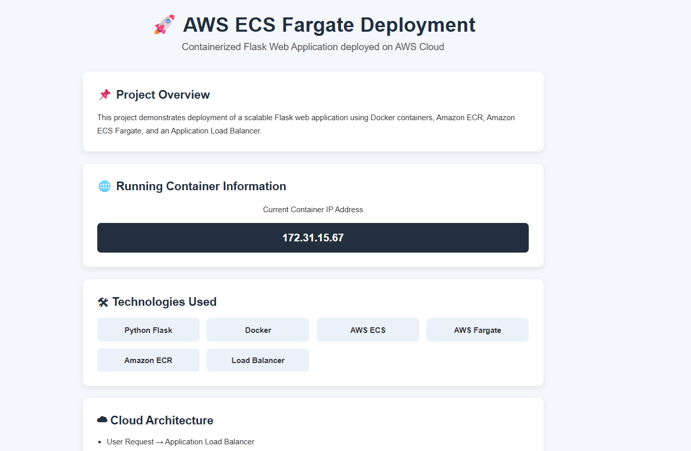
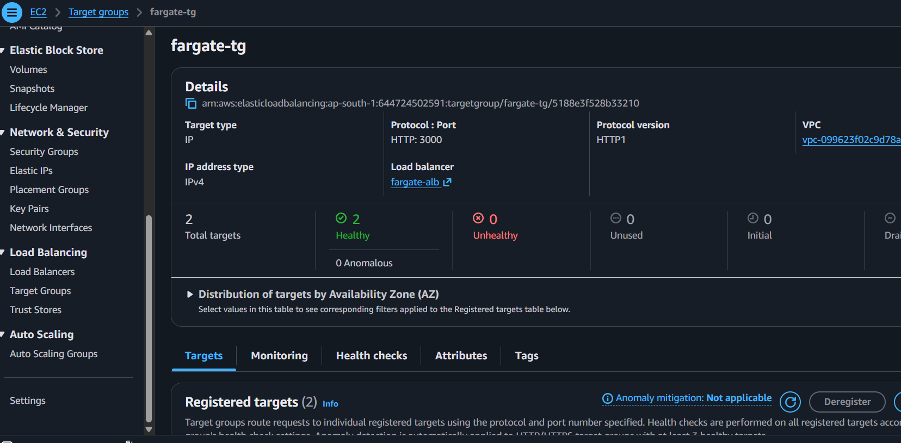

# 🚀 AWS ECS Fargate Deployment Project


## 📌 Project Overview

This project demonstrates deployment of a containerized Flask web application using AWS cloud services.

The application is built using Python Flask, containerized with Docker, pushed to Amazon ECR, and deployed on Amazon ECS Fargate with an Application Load Balancer.

---

# 🛠 Technologies Used

* Python Flask
* Docker
* Amazon ECS
* AWS Fargate
* Amazon ECR
* Application Load Balancer
* Git & GitHub

---

# ☁ Architecture

User Request
⬇
Application Load Balancer
⬇
ECS Fargate Service
⬇
Docker Container
⬇
Flask Application

---

# 📂 Project Structure

```text id="rd3"
aws-ecs-fargate-project/
│
├── app.py
├── Dockerfile
├── requirements.txt
├── .gitignore
│
├── templates/
│   └── index.html
│
└── static/
    └── style.css
```

---

# 🚀 Features

* Containerized Flask application
* Docker image creation
* Amazon ECR image storage
* ECS Fargate deployment
* Application Load Balancer integration
* Responsive frontend UI
* Public cloud hosting

---

# 🐳 Docker Build

```bash id="rd4"
docker build -t student-web-app .
```

---

# ☁ Push to Amazon ECR

```bash id="rd5"
docker tag student-web-app:latest <ECR_URI>

docker push <ECR_URI>
```

---

# 🚀 ECS Deployment

The application is deployed using:

* ECS Fargate Cluster
* ECS Service
* Task Definition
* Application Load Balancer

---

# 📸 Output

The application displays:

* Running container IP
* AWS deployment details
* Cloud architecture overview
* Technology stack

---
# 📸 Screenshots

## Application UI



---

## ECS Cluster


---

## Target Group Health Check



# 👩‍💻 Author

Ramya Sri
